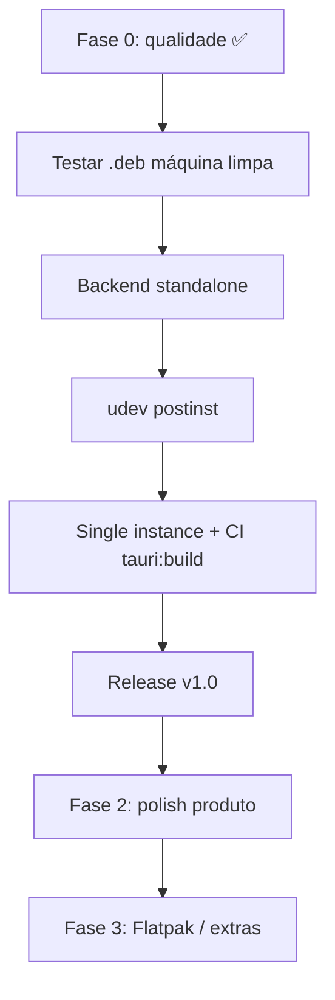

# Próximos passos

Roadmap reorganizado após melhorias de qualidade de código (ESLint, Prettier, Husky, `/health`, cache Angular removido do Git).

---

## Fase 0 — Concluído ✅

### Funcionalidade
- RGB per-key, 11 efeitos host-driven, perfis, auto-reconnect USB
- App Tauri (dev + `.deb`/`.rpm`), bundle backend, CI básica

### Qualidade de código
- **ESLint** + **Prettier** + **Husky** (pre-commit com lint-staged)
- **`GET /health`** — `{ status, version, deviceConnected, deviceLabel }`
- **179 testes** + lint/format na CI
- Cache `frontend/.angular/` fora do Git
- `.editorconfig` para consistência de formatação

Comandos:

```bash
pnpm lint          # ESLint (backend + frontend/src)
pnpm lint:fix      # corrige o que for automático
pnpm format        # Prettier
pnpm format:check  # CI / verificação
curl localhost:3000/health
```

---

## Fase 1 — Release v1.0 (bloqueadores)

Ordem recomendada:

| # | Tarefa | Critério de aceite |
|---|--------|-------------------|
| 1 | **Testar `.deb` em máquina limpa** | Instalar sem clonar repo; documentar o que falha |
| 2 | **Backend standalone (sidecar Tauri)** | App funciona **sem Node.js** no PATH |
| 3 | **udev no instalador** | `postinst` no `.deb` ou wizard guiado |
| 4 | **Single instance** | Segunda instância não disputa o USB |
| 5 | **`tauri:build` na CI** | Build release verificado a cada PR |
| 6 | **Release GitHub v1.0** | Tag + `.deb`/`.rpm` + release notes |

### Detalhe: backend standalone

Hoje o Tauri executa `node dist/start-server.js`. O bundle inclui `node_modules`, mas **Node ≥ 18 ainda é obrigatório**.

Opções: binário sidecar (`externalBin`) via `pkg`, `bun build --compile`, ou Flatpak com runtime Node.

Desafio principal: **`node-hid` nativo**.

### Detalhe: udev

- Script: `bash scripts/install-udev.sh`
- Banner no app quando teclado não detectado
- Falta: instalação automática no `.deb` (`postinst`)

---

## Fase 2 — Produto (pós-release, não bloqueia)

| Tarefa | Notas |
|--------|-------|
| Detectar deps de efeitos na UI | Audio Viz → PulseAudio; Type FX → evdev/`input` |
| Integrar `.desktop` no bundle Tauri | `packaging/redragon-controller.desktop` |
| AppImage | Requer `linuxdeploy` no ambiente de build |
| Legenda teclas sem LED | ScrLk, RShift, Menu |
| Logging estruturado (pino) | Substituir `console.log` gradualmente |
| README usuário final | Instalação sem jargão de dev |

---

## Fase 3 — Futuro

- Flatpak (USB sandboxed)
- Serviço systemd (`redragon-controller.service`)
- Auto-update Tauri
- i18n (en + pt-BR)
- Efeitos firmware nativos K629 (requer captura USB — ver [FIRMWARE-EFFECTS.md](FIRMWARE-EFFECTS.md))

---

## Fluxo visual



---

## Referências

- [PRODUCTION-READINESS.md](PRODUCTION-READINESS.md) — checklist detalhado v1.0
- [TODO.md](../TODO.md) — tarefas operacionais
- [CHANGELOG.md](CHANGELOG.md) — histórico de mudanças
